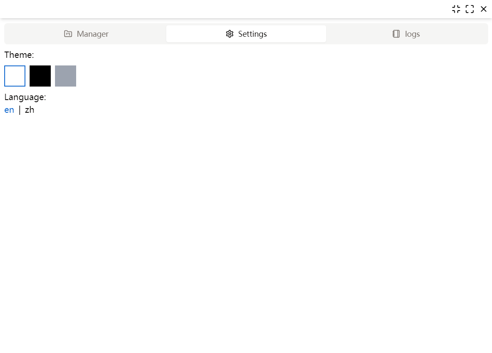

# vscode manager
This project is a VSCode project management tool, as described by its name. It is developed using Tauri(react and rust), with the UI library being [Shadcn/UI](https://github.com/shadcn-ui/ui) and the CSS tool library being [Tailwind.css](https://github.com/tailwindlabs/tailwindcss)  
> Note: This is a learning project primarily aimed at learning Tauri and rust. The project author is a beginner in trust.

## Project interface display
### Project manager page

### Add project page

### Setting page

### logger page

## Features
- [x] Basic project addition
- [x] One click open with vscode or cmd
- [x] Chinese and English support
- [x] Dark mode support
- [x] Operation log display

## Todos
- [] Add the lebel attribute to the project struct to display the technology stack used
- [] Add background image display
